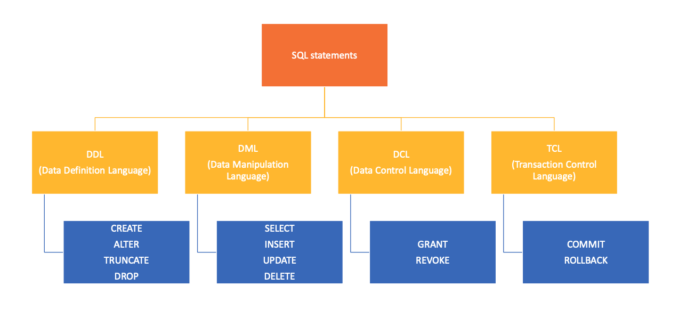
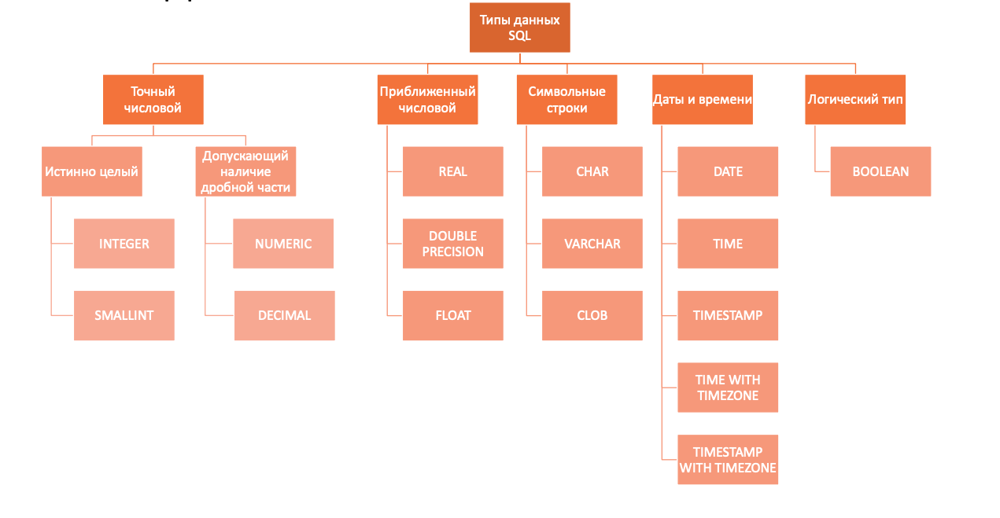

#### Семинар 1 (Операторы, типы данных, базовый синтаксис)

### Организационные ссылки

* [Страница курса на wiki со всеми полезными ссылками](http://wiki.atp-fivt.org/index.php/%D0%91%D0%B0%D0%B7%D1%8B_%D0%B4%D0%B0%D0%BD%D0%BD%D1%8B%D1%85_2024)
* [Ссылка на семинарский чат групп 201-202](https://t.me/+h75siRfffAZkNmRi)
* [Прошлогодняя подробная инструкция по настройке ПО](https://gitlab.atp-fivt.org/courses-public/db2023-supplementary/global/-/tree/main/practice/docker/quickstart)(рекомндуемый вариант) и инструкция [этого года](https://docs.google.com/document/d/1CG6-s5-x1LU3j8mOa66rSC4WcrWbc36_/edit#heading=h.gjdgxs)
  \texttit{При возникновении трудностей при установке ПО на Windows можно перейти в данном репозитории в /regional/sem_1 и найти там дополнение к инструкции по установке софта на Windows}


## 1.1 Операторы

Операторы, которые есть в sql, делятся на несколько типов: 



## 1.2 Типы данных



это самая краткая таблица, так как существуют другие разннобразные типы данных, например, для представления сетевых адресов IPv4, IPv6 или XML-диаграмм. 
Самый обширный список можно найти в [документации](https://www.postgresql.org/docs/current/datatype.html). Здесь, рекомендуется уделить внимание видам хранения [даты/времени](https://www.postgresql.org/docs/current/datatype-datetime.html).

## 2.1 **Data Defenition Language **

1. `CREATE` – создание объектов БД
```sql
CREATE TABLE [IF NOT EXISTS] table_name(
    col_name_1   datatype_1,
    col_name_2   datatype_2,
    ...
    col_name_N   datatype_N
);
```

2. `ALTER` – модификация объектов БД
```sql
ALTER TABLE table_name ADD column_name datatype;
ALTER TABLE table_name DROP column_name;
ALTER TABLE table_name RENAME column_name TO new_column_name;
ALTER TABLE table_name ALTER column_name TYPE datatype;
...
```

3. `DROP` – удаление объектов БД 
```sql
DROP TABLE [IF EXISTS] table_name;
```

4. `TRUNCATE` – удаление содержимого объекта БД 
```sql
TRUNCATE TABLE table_name;
```

Основные отличия DROP от DELETE:*
* DROP удаляет саму таблицу, в то время, как TRUNCATE очищает таблицу от данных, но сам "каркас" таблицы остается жить.
* DELETE позволяет использовать условия WHERE которых вы можете указать в каких случаях необходимо произвести удаления, а TRUNICATE вам этого сделать не позволит, WHERE в ней нет.
* DELETE - медленнее, TRUNICATE - быстрее (заметно будет при больших объёмах данных)
* DELETE записывает в журнал транзакций каждое удаление
* для DELETE требуются права на удаление, а TRUNICATE требует права на изменение таблицы ( ALTER TABLE)
* вызов DELETE может активировать триггеры,  а TRUNICATE нет
* DELETE блокирует удаляемую строку (строки) TRUNICATE - блокирует таблицу.

## ** 2.2 Data Manipulation Language **

1. `SELECT` – выбирает данные, удовлетворяющие заданным условиям
2. `INSERT` – добавляет новые данные
```sql
INSERT INTO table_name [(comma_separated_column_names)] VALUES (comma_separated_values);
```

3. `UPDATE` – изменяет (обновляет) существующие данные
```sql
UPDATE table_name
    SET update_assignment_comma_list
WHERE conditional_experssion;
```

4. `DELETE` – удаляет существующие данные (данные удаляются построчно – можно задавать условие, "откатывать" удаление)
```sql
DELETE
    FROM table_name
[WHERE conditional_expression];
```

### 3.1 Структура запроса

Порядок написания запроса:

```sql
SELECT [DISTINCT] select_item_comma_list -- список столбцов для вывода
FROM table_reference_comma_list -- список таблиц
[WHERE conditional_expression] -- условия фильтрации, можно использовать AND / OR / NOT
[GROUP BY column_name_comma_list] -- условие группировки
[HAVING conditional_expression] -- условие фильтрации после группировки
[ORDER BY order_item_comma_list]; -- список полей, по которым сортируется вывод
```

#### 3.2 Порядок выполнения запроса

Порядок выполнения запроса отличается от порядка его записи, это необходимо помнить:

**FROM <span>&#8594;</span> WHERE <span>&#8594;</span> GROUP BY <span>&#8594;</span> HAVING <span>&#8594;</span> SELECT <span>&#8594;</span> ORDER BY**


#### 3.3 Агрегирующие функции

Агрегатные функции (агрегации) — это функции, которые вычисляются от группы значений и объединяют их в одно результирующее значение.
В табличной модели данных это значит, что функция берет ноль, одну или несколько строк для какой-то колонки и возвращает единственное значение.

При группировке в части `SELECT` могут встречаться либо атрибуты, по которым происходит группировка(т.е. используетcя GROUP BY), либо атрибуты, которые подаются на вход агрегирующим функциям. При выполнении запроса функции не учитывается специальное значение `NULL`, которым обозначается отсутствующее значение.
Ниже приведен список стандартных агрегатных функций SQL:					
* `count()` – количество записей с известным значением. Если необходимо подсчитать количество уникальных значений, можно использовать `count(DISTINCT field_nm)`
* `max()` - наибольшее из всех выбранных значений поля
* `min()` - наименьшее из всех выбранных значений поля
* `sum()` - сумма всех выбранных значений поля
* `avg()` - среднее всех выбранных значений поля

примечание: COUNT(*) — специальная форма функции COUNT, которая возвращает количество всех строк в указанной таблице. Обратите внимание: COUNT(*) считает дубликат и NULL.

#### 1.4 Полезные функции

Иногда бывает полезно использовать в запросе специальные функции:
* `IN` - принадлежность определенному набору значений:
`X IN (a1, a2, ..., an)` <span>&#8803;</span> X = a<sub>1</sub> or X = a<sub>2</sub> or ... or X = a<sub>n</sub>
* `BETWEEN` - принадлежность определенному интервалу значений:
`X BETWEEN A AND B` <span>&#8803;</span> (X >= A and X <= B) or (X <= A and X >= B)
* `LIKE` - удовлетворение текста паттерну: `X LIKE '0%abc_0'`, где `_` - ровно 1 символ, а `%` - любая последовательность символов (в том числе нулевой длины).
* `SIMILAR TO` - удовлетворение текста регулярному выражению SQL (похожи на POSIX): `'abc' SIMILAR TO '%(b|d)%'`
* `IF ... THEN ... [ELSIF ... THEN ... ELSE ...] END IF` - ветвления, **пример**:
```postgresql
SELECT
    IF number = 0 THEN
        'zero'
    ELSIF number > 0 THEN
        'positive'
    ELSIF number < 0 THEN
        'negative'
    ELSE
        'NULL'
    END IF AS number_class
FROM
    numbers
```
* `CASE [...] WHEN ... THEN ... ELSE ... END CASE` - еще один аналог ветвлений, **пример**:
```postgresql
SELECT
    CASE 
        WHEN number = 0 THEN
            'zero'
        WHEN number > 0 THEN
            'positive'
        WHEN number < 0 THEN
            'negative'
        ELSE
            'NULL'
    END CASE AS number_class
FROM
    numbers
```
* `DISTINCT ON` - исключает строки, совпадающие по всем указанным выражениям, **пример**:
```postgresql
-- вывести кол-во уникальных отделов
SELECT
    count(DISTINCT ON department_nm)
FROM
    salary;
```
* [Еще немного полезностей](https://postgrespro.ru/docs/postgresql/9.5/functions-conditional)

