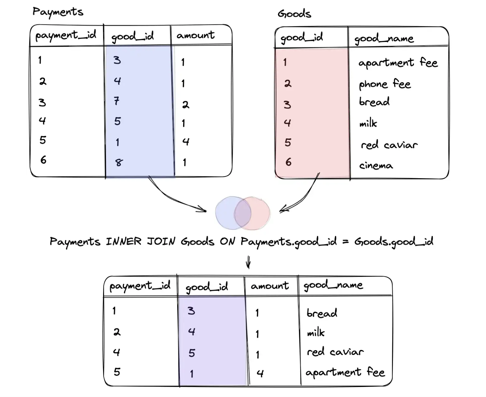

## Семинар 2 (Joins, operations with null, потенциальные/первичные/суррогатные ключи)

### Еще немного про агрегатные функции

При группировке в SELECT можно выводить только литералы, результаты агрегатных функций и поля, по которым осуществлялась группировка.

Общий струкрута запроса с агрегатной функцией

``` sql
SELECT [литералы, агрегатные_функции, поля_группировки]
FROM имя_таблицы
GROUP BY поля_группировки;
```

Следует иметь в виду, что для GROUP BY все значения NULL трактуются как равные, т.е. при группировке по полю, содержащему NULL-значения, все такие строки попадут в одну группу.


### Операции соединения таблиц (JOIN)
					
Операции соединения делятся на 3 группы:

* `INNER JOIN` - соединение 2 таблиц по условию. В результирующую выборку попадут только те записи, которые удовлетворяют условию соединения     
* `CROSS JOIN` - декартово произведение 2 таблиц
* `OUTER JOIN` - соединение 2 таблиц по условию. В результирующую выборку могут попасть записи, которые не удовлетворяют условию соединения: 
    * `LEFT (OUTER) JOIN` - все строки "левой" таблицы попадают в итоговую выборку
    * `RIGHT (OUTER) JOIN` - все строки "правой" таблицы попадают в итоговую выборку 
    * `FULL (OUTER) JOIN` - все строки обеих таблиц попадают в итоговую выборку


#### Inner join 
Чаще всего используется для объединения таблиц, чтобы получить подмножества данных, которые присутствуют в обеих таблицах.

* Логический оператор, содиняющий две таблицы
* Этот тип соединения выбирается автоматически, если не укзывать вид соединения.
* Порядок соединения является неважным, так как оператор является коммутативным
* Возвращает только те строки, где соблюдается условие объединения



#### Self join
Этот запрос полезен, когда у вас есть таблица со связанными данными в разных строках, которые вы хотите объединить на основе общего поля. Самый частый пример использования SELF JOIN — обработка деревьев или графов, которые хранятся в одной таблице.

* Запрос, который предназначен для самообъединения таблицы, то есть таблица соединяется сама с собой.
* Основан на работе оператора INNER JOIN, также можно использовать LEFT JOIN или RIGHT JOIN. В блоке ON указываются условия для объединения таблиц.

[Здесь](https://learnsql.com/blog/what-is-self-join-sql/) немного примеров про self join.
#### Cross join 
Оператор, который пзволяет получить декартово произведение двух таблиц.

* В результате создается набор, включающий все возможные комбинации строк в таблицах. Декартово произведение в данном случае — это результат соединения строки из первой таблицы с каждой строкой из второй таблицы.

#### Outer join 
Соединение двух таблиц, в результат которого обязательно входят все строки либо одной, либо обеих таблиц. 

##### Left outer join
* Порядок соединения является важным, так как оператор не коммутативен
* тело результата формуруется по следующему принципу:
1) Выполняется Ineer join по заданному предикату
2) в результат добавляются те строки левой таблицы, которые не вошли во внутреннее соединение на шаге 1. Для таких строк столбцы, соответствующие правой таблице, заполняются значениями NULL.

##### Right outer join
   Аналогично левому соединению, только таблицы меняются местами

##### Full outer join
 * тело результата формуруется по следующему принципу:
 1) В результат включается внутреннее соединение (INNER JOIN) первой и второй таблиц по предикату.
 2) В результат добавляются те строки первой таблицы, которые не вошли во внутреннее соединение на шаге 1. Для таких строк столбцы, соответствующие второй таблице, заполняются значениями NULL.
 3) В результат добавляются те строки второй таблицы, которые не вошли во внутреннее соединение на шаге 1. Для таких строк столбцы, соответствующие первой таблице, заполняются значениями NULL.

Примеры использования каждого соединения смотри в файле [console.sql](https://github.com/Esi4ka/db-2024-seminars/blob/main/phystech/sem_2/console.sql).

Еще больше примеров [здесь](https://sql-academy.org/ru/guide/outer-join).
### Ключи

#### Потенциальные ключи

**Потенциальный ключ** – подмножество атрибутов отношения, удовлетворяющее требованиям уникальности и минимальности:
* *Уникальность*: нет и <ins>не может быть</ins> двух кортежей данного отношения, в которых значения этого подмножества атрибутов совпадают;
* *Минимальность*: в составе потенциального ключа отсутствует меньшее подмножество атрибутов, удовлетворяющее условию уникальности;
* Типы:
    * *простой* (состоит ровно из одного атрибута)
    * *составной* (состоит из двух и более атрибутов)


Пример нескольких потенциальных составных ключей:  
```sql
CREATE TABLE flight_schedule (
  departure timestampt,
  gate text,
  pilot text

  UNIQUE(departure, gate),
  UNIQUE(departure, pilot)
);
```

**Первичный ключ** *(Primary key, PK)* — любой из потенциальных ключей, выбранный в качестве основного; выбирают в качестве первичного такой ключ, который занимает меньше места при хранении и который не утратит свою уникальность со временем. (потенциальный ключ существует всегда, даже если включает в себя все атрибуты отношения) **Альтернативными ключами** называются потенциальные ключи, не выбранные в качестве первичного.

Типы:
* *естественный* (основанный на уже существующем поле)
* *интеллектуальный* (основанный на естественном ключе путем добавления дополнительного поля)

**Суррогатный ключ** — это дополнительное служебное поле, которое добавляется к уже имеющимся информационным полям таблицы, единственное предназначение которого – служить первичным ключом. (значение генерируется искусственно).

Пусть R<sub>1</sub> и R<sub>2</sub> – две переменные отношения, не обязательно различные. **Внешним ключом FK (Foreign key)** в R<sub>2</sub> является подмножество атрибутов переменной R2 такое, что выполняются следующие требования:
* В переменной отношения R<sub>1</sub> имеется потенциальный ключ PK такой, что PK и FK совпадают с точностью до переименования атрибутов (FK из R<sub>2</sub> является PK из R<sub>1</sub>)
* В любой момент времени каждое значение FK в текущем значении R<sub>2</sub> идентично значению PK в некотором кортеже в текущем значении R<sub>1</sub>. Иными словами, в любой момент времени множество всех значений FK в R<sub>2</sub> является подмножеством значений PK в R<sub>1</sub>.

* *Родительское (главное/целевое) отношение* — отношение R<sub>1</sub>, содержащее потенциальный ключ.
* *Дочернее (подчиненное) отношение* — отношение R<sub>2</sub>, содержащее в себе ссылку на сущность, в которой находятся нужные нам атрибуты. (содержащее в себе внешний ключ)

#### Создание ключей

`PRIMARY KEY`
```postgresql
CREATE TABLE PERSON (
    ID         INTEGER      PRIMARY KEY,
    LAST_NAME  VARCHAR(255) NOT NULL,
    FIRST_NAME VARCHAR(255) NOT NULL,
    AGE        INTEGER
);

ALTER TABLE PERSON ADD PRIMARY KEY (ID);

------------------------------------------

CREATE TABLE PERSON (
    ID         INTEGER,
    LAST_NAME  VARCHAR(255),
    FIRST_NAME VARCHAR(255) NOT NULL,
    AGE        INTEGER,
    CONSTRAINT PK_Person PRIMARY KEY (ID, LAST_NAME)
);

ALTER TABLE PERSON
ADD CONSTRAINT PK_Person PRIMARY KEY (ID, LAST_NAME);

ALTER TABLE PERSON
DROP CONSTRAINT PK_Person;
```

`FOREIGN KEY`
```postgresql
CREATE TABLE ORDER (
    ORDER_ID     INTEGER,
    ORDER_NUMBER INTEGER NOT NULL,
    PERSON_ID    INTEGER,
    
    PRIMARY KEY (ORDER_ID),
    CONSTRAINT FK_PersonOrder FOREIGN KEY (PERSON_ID) REFERENCES PERSON(PERSON_ID)
);

ALTER TABLE ORDER ADD CONSTRAINT FK_PersonOrder
FOREIGN KEY (PERSON_ID) REFERENCES PERSON(PERSON_ID);

ALTER TABLE ORDER DROP CONSTRAINT FK_PersonOrder;

------------------------------------------

CREATE TABLE ORDER (
    ORDER_ID     INTEGER PRIMARY KEY,
    ORDER_NUMBER INTEGER NOT NULL,
    PERSON_ID    INTEGER REFERENCES PERSON(PERSON_ID)
);

ALTER TABLE ORDER
ADD FOREIGN KEY (PERSON_ID) REFERENCES PERSON(PERSON_ID);
```
