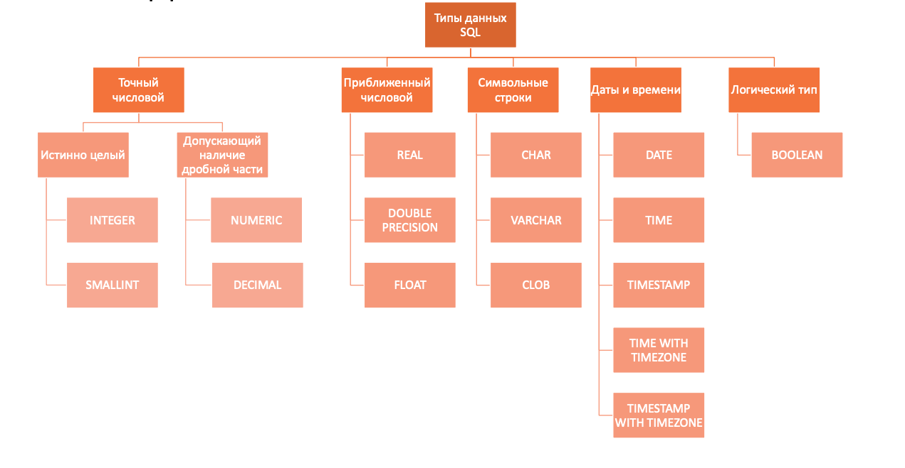

## Семинар 2 (Операторы DDL, DML, типы данных, структура запроса)

### Типы данных



это самая краткая таблица, так как существуют другие разннобразные типы данных, например, для представления сетевых адресов IPv4, IPv6 или XML-диаграмм. 
Самый обширный список можно найти в [документации](https://www.postgresql.org/docs/current/datatype.html). Здесь, рекомендуется уделить внимание видам хранения [даты/времени](https://www.postgresql.org/docs/current/datatype-datetime.html).

### Операторы

Операторы, которые есть в sql, делятся на несколько типов: 


#### Data Defenition Language

1. `CREATE` – создание объектов БД
```sql
CREATE TABLE [IF NOT EXISTS] table_name(
    col_name_1   datatype_1,
    col_name_2   datatype_2,
    ...
    col_name_N   datatype_N
);
```

2. `ALTER` – модификация объектов БД
```sql
ALTER TABLE table_name ADD column_name datatype;
ALTER TABLE table_name DROP column_name;
ALTER TABLE table_name RENAME column_name TO new_column_name;
ALTER TABLE table_name ALTER column_name TYPE datatype;
...
```

3. `DROP` – удаление объектов БД 
```sql
DROP TABLE [IF EXISTS] table_name;
```

4. `TRUNCATE` – удаление содержимого объекта БД 
```sql
TRUNCATE TABLE table_name;
```

#### Data Manipulation Language

1. `SELECT` – выбирает данные, удовлетворяющие заданным условиям
2. `INSERT` – добавляет новые данные
```sql
INSERT INTO table_name [(comma_separated_column_names)] VALUES (comma_separated_values);
```

3. `UPDATE` – изменяет (обновляет) существующие данные
```sql
UPDATE table_name
    SET update_assignment_comma_list
WHERE conditional_experssion;
```

4. `DELETE` – удаляет существующие данные (данные удаляются построчно – можно задавать условие, "откатывать" удаление)
```sql
DELETE
    FROM table_name
[WHERE conditional_expression];
```

### Структура запроса

Порядок написания запроса:

```sql
SELECT [DISTINCT] select_item_comma_list -- список столбцов для вывода
FROM table_reference_comma_list -- список таблиц
[WHERE conditional_expression] -- условия фильтрации, можно использовать AND / OR / NOT
[GROUP BY column_name_comma_list] -- условие группировки
[HAVING conditional_expression] -- условие фильтрации после группировки
[ORDER BY order_item_comma_list]; -- список полей, по которым сортируется вывод
```

#### Порядок выполнения запроса

Порядок выполнения запроса отличается от порядка его записи, это необходимо помнить:

**FROM <span>&#8594;</span> WHERE <span>&#8594;</span> GROUP BY <span>&#8594;</span> HAVING <span>&#8594;</span> SELECT <span>&#8594;</span> ORDER BY**


#### 1.4 Полезные функции

Иногда бывает полезно использовать в запросе специальные функции:
* `IN` - принадлежность определенному набору значений:
`X IN (a1, a2, ..., an)` <span>&#8803;</span> X = a<sub>1</sub> or X = a<sub>2</sub> or ... or X = a<sub>n</sub>
* `BETWEEN` - принадлежность определенному интервалу значений:
`X BETWEEN A AND B` <span>&#8803;</span> (X >= A and X <= B) or (X <= A and X >= B)
* `LIKE` - удовлетворение текста паттерну: `X LIKE '0%abc_0'`, где `_` - ровно 1 символ, а `%` - любая последовательность символов (в том числе нулевой длины).
* `SIMILAR TO` - удовлетворение текста регулярному выражению SQL (похожи на POSIX): `'abc' SIMILAR TO '%(b|d)%'`

```
* `DISTINCT ON` - исключает строки, совпадающие по всем указанным выражениям, **пример**:

```postgresql
-- вывести кол-во уникальных отделов
SELECT
    count(DISTINCT ON department_nm)
FROM
    salary;
```

### Агрегирующие функции

Агрегатные функции (агрегации) — это функции, которые вычисляются от группы значений и объединяют их в одно результирующее значение.
В табличной модели данных это значит, что функция берет ноль, одну или несколько строк для какой-то колонки и возвращает единственное значение.

При группировке в части `SELECT` могут встречаться либо атрибуты, по которым происходит группировка(т.е. используетcя GROUP BY), либо атрибуты, которые подаются на вход агрегирующим функциям. При выполнении запроса функции не учитывается специальное значение `NULL`, которым обозначается отсутствующее значение.
Сейчас мы познакомимся с одной агрегирующей функцией: 				
* `count()` – количество записей с известным значением. Если необходимо подсчитать количество уникальных значений, можно использовать `count(DISTINCT field_nm)`


примечание: ```count(*)``` — специальная форма функции count, которая возвращает количество всех строк в указанной таблице. Обратите внимание: ```count(*)``` считает дубликат и NULL. [Здесь](https://learnsql.com/blog/difference-between-count-distinct/) более подробно про count.

примечание: интересная [статья](https://habr.com/ru/articles/271797/) про ```count(*)``` для интересующихся
### Практическая часть

* для различных тестовых задачек можно использовать [online окружение "как онлайн компилятор sql"](https://sqlize.online/sql/psql14/9cffb8e3d397e93627eb41cd55b10c20/)
  
Будем работать с данными о фильмах с IMDB (рандомные 300 фильмов из топ-1000)

1. Создать схему `sem_1`

2. Создать таблицу `sem_1.movies` со следующими полями и запустить операции вставки (из отдельного файла)  
   
   title (название фильма)  
   release_year (год выпуска)  
   duration_min (длительность в мин)  
   genre (жанры)  
   rating (рейтинг)  
   director (режиссёр)  
   star_1 (1й главный актёр)  
   star_2 (2й главный актёр)  

3. Посмотреть метаданные о таблице и столбцах в information_schema.tables и information_schema.columns

4. Выведи всё содержимое таблицы

5. Выведи все названия фильмов и их год выпуска

6. Выведите всех режиссёров, встречающихся в таблице

7. В каком году был снят 'Fight Club'? Вывести только год

8. Выведите все фильмы 'Christopher Nolan', год и рейтинг

9. Выведите все фильмы, в которых главную роль сыграл 'Christian Bale'

10. Найдите все комедии (Comedy) длительностью меньше 2х часов и с рейтингом не менее 8.5
Выводить название фильма, год, длительность, жанр, рейтинг

11. Выведите все фильмы, снятые до 2010 года, в которых снимался 'Leonardo DiCaprio' или 'Tom Hanks'.
Выводить название фильма, год, двух главных героев

12. Выведите все фильмы жанра 'Drama'
Учитывайте, как лежат данные в столбце genre

13. Выведите всех актёров, которых зовут Jack, Sam или John (можно только для star_1).

14. Выведите все названия фильмов, в которых содержится либо цифра 3, либо цифра 7.

* [Еще немного полезностей](https://postgrespro.ru/docs/postgresql/9.5/functions-conditional)


