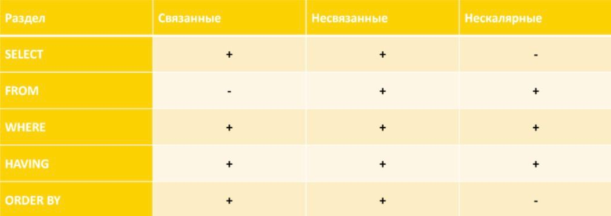

## Семинар 3. Сложные запросы, подзапросы, ссылочная целостность

### 1. Сложные запросы и подзапросы

#### 1.1. Структура запроса

**Порядок написания запроса**

```postgresql
SELECT
  [ALL | DISTINCT [ON (expression [, ...] )] ]
  [* | expression [AS output_name] [, ...] ]
[FROM from_item [, ...] ]
[WHERE condition]
[GROUP BY grouping_element [, ...]]
[HAVING condition]
[ORDER BY expression [ASC | DESC | USING operator] [NULLS {FIRST | LAST}]
     [, ...]]
[LIMIT {count | ALL}]
[OFFSET start [ROW | ROWS]]
[FETCH {FIRST | NEXT} [count] {ROW | ROWS} ONLY]
```

#### 1.2 Полезные функции

Иногда бывает полезно использовать в запросе специальные функции:
* `IN` - принадлежность определенному набору значений:
`X IN (a1, a2, ..., an)` <span>&#8803;</span> X = a<sub>1</sub> or X = a<sub>2</sub> or ... or X = a<sub>n</sub>
* `BETWEEN` - принадлежность определенному интервалу значений:
`X BETWEEN A AND B` <span>&#8803;</span> (X >= A and X <= B) or (X <= A and X >= B)
* `LIKE` - удовлетворение текста паттерну: `X LIKE '0%abc_0'`, где `_` - ровно 1 символ, а `%` - любая последовательность символов (в том числе нулевой длины).
* `IF ... THEN ... [ELSIF ... THEN ... ELSE ...] END IF` - ветвления, **пример**:
```postgresql
SELECT
    IF number = 0 THEN
        'zero'
    ELSIF number > 0 THEN
        'positive'
    ELSIF number < 0 THEN
        'negative'
    ELSE
        'NULL'
    END IF AS number_class
FROM
    numbers
```
* `CASE [...] WHEN ... THEN ... ELSE ... END CASE` - еще один аналог ветвлений, **пример**:
```postgresql
SELECT
    CASE 
        WHEN number = 0 THEN
            'zero'
        WHEN number > 0 THEN
            'positive'
        WHEN number < 0 THEN
            'negative'
        ELSE
            'NULL'
    END CASE AS number_class
FROM
    numbers
```
* `DISTINCT ON` - исключает строки, совпадающие по всем указанным выражениям, **пример**:
```postgresql
-- вывести кол-во уникальных отделов
SELECT
    count(DISTINCT ON department_nm)
FROM
    salary;
```

#### 1.3 Ключевое слово `WITH`
`WITH` предоставляет способ записывать дополнительные операторы для применения в больших запросах. 
Эти операторы, которые также называют общими табличными выражениями (Common Table Expressions, CTE), 
можно представить как определения временных таблиц, существующих только для одного запроса. 
Более подробно про СТЕ будет на следующих семинарах.
**Пример**:
```postgresql
WITH 
    regional_sales AS (
        SELECT 
            region, 
            SUM(amount) AS total_sales
        FROM 
            orders
        GROUP BY 
            region
    ), 
    top_regions AS (
        SELECT 
            region
        FROM 
            regional_sales
        WHERE 
            total_sales > (SELECT SUM(total_sales)/10 FROM regional_sales)
   )
SELECT 
    region,
    product,
    SUM(quantity) AS product_units,
    SUM(amount) AS product_sales
FROM 
    orders
WHERE 
    region IN (SELECT region FROM top_regions)
GROUP BY 
    region, 
    product;
```


#### 1.4 Подзапросы

**Подзапрос** — запрос, содержащийся в другом SQL-запросе. Запрос, содержащий другой подзапрос, называется *содержащим выражением*.

* Подзапрос всегда заключен в круглые скобки и обычно выполняется до содержащего выражения.
* Подзапросы могут вкладываться друг в друга.
* В `SELECT’e` подзапросы можно использовать во всех разделах, кроме `GROUP BY`.

**Классификация подзапросов:**
1. По взаимодействию с содержащим выражением:
    * Связанные (т.е. ссылающиеся на столбцы основного запроса):
        * Для написания таких запросов полезно использование алиасов. (`SELECT … AS T`)
        * Для случаев, когда в основном запросе и в подзапросе используется одна и та же таблица, использование алиасов обязательно!
        * Выполняются для каждой строки содержащего выражения.
    * Несвязанные (т.е. полностью самодостаточные и не зависящие от основного запроса) — выполняются перед выполнением содержащего выражения.
2. По результату выполнения:
    * Скалярные (1 столбец и 1 строка)
    * Нескалярные

**Использование подзапросов:**


#### 1.5 Предикаты (для подзапросов вида 1 столбец и несколько строк)

* `EXISTS` — Значением условия `EXISTS` является `TRUE` в том и только в том случае, когда мощность таблицы-результата подзапроса больше нуля, иначе значением условия является `FALSE`:
```postgresql
SELECT 
    SupplierName
FROM 
    Suppliers
WHERE 
    EXISTS(
        SELECT 
            ProductName
        FROM 
            Products
        WHERE 
            SupplierId = Suppliers.supplierId
            AND Price < 20
    );
```

* `IN` — Предикат `IN` для подзапросов работает так же, как и для обычных запросов (проверка наличия значения в списке):
```postgresql
SELECT 
    emp_id, 
    fname, 
    lname, 
    title
FROM 
    employee
WHERE 
    emp_id IN(
        SELECT 
            superior_emp_id
        FROM 
            employee
    );
```

* `ALL` — `TRUE`, если результат подзапроса пуст или значение предиката равно TRUE для каждой строки подзапроса; если хотя бы что-то `FALSE`, то вернет `FALSE`, во всех остальных случаях вернет `UNKNOWN`:
```postgresql
SELECT 
    EMP_NO
FROM 
    EMP
WHERE 
    DEPT_NO = 65
    AND EMP_SAL >= ALL(
        SELECT 
            EMP1.EMP_SAL
        FROM 
            EMP AS EMP1
        WHERE 
            EMP.DEPT_NO = EMP1.DEPT_NO
    );
```

* `ANY` — `FALSE`, если результат подзапроса пуст или значение условия равно `FALSE` для каждой строки подзапроса; если хотя бы что-то `TRUE`, то вернет `TRUE`, в остальных случаях вернет `UNKNOWN`:
```postgresql
SELECT 
    EMP_NO
FROM 
    EMP
WHERE 
    DEPT_NO = 65
    AND EMP_SAL > ANY(
        SELECT 
            EMP1.EMP_SAL
        FROM 
            EMP AS EMP1
        WHERE 
            EMP.DEPT_NO = EMP1.DEPT_NO
    );
```

`CREATE TABLE AS` — создаёт таблицу и наполняет её данными, полученными в результате выполнения `SELECT`. Столбцы этой таблицы получают имена и типы данных в соответствии со столбцами результата `SELECT` (хотя имена столбцов можно переопределить, добавив явно список новых имен столбцов).

```sql
CREATE TABLE NEW_TABLE AS
    SELECT 
        *
    FROM 
        OLD_TABLE;
```

`CREATE TABLE AS` напоминает создание представления, но на самом деле есть значительная разница: эта команда создает новую таблицу и выполняет запрос только раз, чтобы наполнить таблицу начальными данными. Последующие изменения в исходных таблицах запроса в новой таблице отражаться не будут. С представлением, напротив, определяющая его команда `SELECT` выполняется при каждой выборке из него.


### 2. Ссылочная целостность

**Ссылочная целостность** – это необходимое качество реляционной базы данных, заключающееся в отсутствии в любом её отношении внешних ключей, ссылающихся на несуществующие кортежи.

База данных обладает свойством ссылочной целостности, когда для любой пары связанных внешним ключом отношений в ней условие ссылочной целостности выполняется.

**В реальных бд ссылочная целостность не всегда поддерживается.**

Нарушения ссылочной целостности могут появиться в ходе эксплуатации по ряду причин:
* Иногда разработчики просто пропускают шаг создания ссылок
* Некорректная работа прикладного программного обеспечения:
    * Неполная запись объектов (данные объекта размещаются в записях нескольких таблиц, а программа не записывает какую-то из них).
    * Некорректная правка ссылки (значение внешнего ключа изменяется на такое, которому не соответствует ни одна запись в связанной таблице)
    * Правка первичного ключа без каскадного обновления (в таблице, на которую есть ссылки, правится первичный ключ, но при этом внешние ключи в связанных с ней таблицах остаются без изменения)
    * Удаление записи без каскадного обновления (Из таблицы удаляется запись, на которую имеются ссылки по внешним ключам других таблиц, при этом в связанных записях внешние ключи не меняются. В результате все ссылающиеся на нее записи других таблиц становятся некорректными)
* Сбои в работе системного программного обеспечения и оборудования:
    * Если необходимо внести данные об объекте в несколько страниц, то в ходе транзакции ссылочная целостность будет нарушена — в часть таблиц информация уже внесена, а в часть — еще нет. Так, если операция будет прервана до завершения по каким-то техническим причинам, то часть добавленных записей останется с некорректными ссылками.
* Иногда же на практике при отсутствии какой-то информации об объекте ключ остается пустым (имеет значение NULL). И хотя с точки зрения теории это недопустимо, легенда гласит, что на практике это иногда удобно в применении.

#### 2.1 Теоретическая справка (ограничения)

1. `NOT NULL` – значение всегда известно, недопустимо значение `NULL`.
2. `UNIQUE` – значения в столбце должны быть уникальны.
3. `PRIMARY KEY` – первичный ключ таблицы. В некоторых СУБД требуется дополнительно ограничивать `NOT NULL` (чаще выставлено по дефолту; также заведомо является `UNIQUE`)
4. `FOREIGN KEY` – внешний ключ, необходима ссылка на другую таблицу.
5. `CHECK` – проверка на соответствие определенному критерию.
6. `DEFAULT` – значение по умолчанию; используется, если пользователь не задал значения.

#### 2.2 Синтаксис добавления ограничений

1. `NOT NULL`
```postgresql
CREATE TABLE PERSON (
    ID         INTEGER      NOT NULL,
    LAST_NAME  VARCHAR(255) NOT NULL,
    FIRST_NAME VARCHAR(255) NOT NULL,
    AGE        INTEGER
);
```

2. `UNIQUE`
```postgresql
CREATE TABLE PERSON (
    ID         INTEGER      NOT NULL UNIQUE,
    LAST_NAME  VARCHAR(255) NOT NULL,
    FIRST_NAME VARCHAR(255) NOT NULL,
    AGE        INTEGER
);

ALTER TABLE PERSON ADD UNIQUE (ID);

ALTER TABLE PERSON
ADD CONSTRAINT UC_Person UNIQUE (ID, LAST_NAME);

ALTER TABLE PERSON
DROP CONSTRAINT UC_Person;
```

3. `PRIMARY KEY`
```postgresql
CREATE TABLE PERSON (
    ID         INTEGER      PRIMARY KEY,
    LAST_NAME  VARCHAR(255) NOT NULL,
    FIRST_NAME VARCHAR(255) NOT NULL,
    AGE        INTEGER
);

ALTER TABLE PERSON ADD PRIMARY KEY (ID);

------------------------------------------

CREATE TABLE PERSON (
    ID         INTEGER,
    LAST_NAME  VARCHAR(255),
    FIRST_NAME VARCHAR(255) NOT NULL,
    AGE        INTEGER,
    CONSTRAINT PK_Person PRIMARY KEY (ID, LAST_NAME)
);

ALTER TABLE PERSON
ADD CONSTRAINT PK_Person PRIMARY KEY (ID, LAST_NAME);

ALTER TABLE PERSON
DROP CONSTRAINT PK_Person;
```

4. `FOREIGN KEY`
```postgresql
CREATE TABLE ORDER (
    ORDER_ID     INTEGER,
    ORDER_NUMBER INTEGER NOT NULL,
    PERSON_ID    INTEGER,
    
    PRIMARY KEY (ORDER_ID),
    CONSTRAINT FK_PersonOrder FOREIGN KEY (PERSON_ID) REFERENCES PERSON(PERSON_ID)
);

ALTER TABLE ORDER ADD CONSTRAINT FK_PersonOrder
FOREIGN KEY (PERSON_ID) REFERENCES PERSON(PERSON_ID);

ALTER TABLE ORDER DROP CONSTRAINT FK_PersonOrder;

------------------------------------------

CREATE TABLE ORDER (
    ORDER_ID     INTEGER PRIMARY KEY,
    ORDER_NUMBER INTEGER NOT NULL,
    PERSON_ID    INTEGER REFERENCES PERSON(PERSON_ID)
);

ALTER TABLE ORDER
ADD FOREIGN KEY (PERSON_ID) REFERENCES PERSON(PERSON_ID);
```

При определении FK у нас должно совпадать количество атрибутов в обеих таблицах, которые мы "мэтчим". Также в таблице, для которой атрибуты являются PK, должны быть заданы соответствующие ограничения – иначе будет ошибка `there is no unique constraint matching given keys for referenced table`.

<span>&ensp;&nbsp;</span>4<span>&frac34;</span>. Поддержание ссылочной целостности

* `CASCADE` – при удалении / изменении строки главной таблицы соответствующая запись дочерней таблицы также будет удалена / изменена.

* `RESTRICT` – cтрока не может быть удалена / изменена, если на нее имеется ссылка;  Значение не может быть удалено / изменено, если на него есть ссылка.

* `NO ACTION`

    * Имеет сходства с `RESTRICT`, но проверка происходит в конце транзакции;
    * Для разницы с RESTRICT нужно явно прописывать в транзакции выражение ([`SET CONSTRAINTS`](https://www.postgresql.org/docs/current/sql-set-constraints.html))

    ```postgresql
    SET CONSTRAINTS { ALL | name [, ...] } { DEFERRED | IMMEDIATE }
    ```

* `SET NULL` – при удалении записи главной таблицы, соответствующее значение дочерней таблицы становится `NULL`.

* `SET DEFAULT` – аналогично `SET NULL`, но вместо значения `NULL` устанавливается некоторое значение по умолчанию.

```postgresql
CREATE TABLE ORDER (
    ORDER_ID     INTEGER,
    ORDER_NUMBER INTEGER NOT NULL,
    PERSON_ID    INTEGER,
    
    PRIMARY KEY (ORDER_ID),
    CONSTRAINT FK_PersonOrder FOREIGN KEY (PERSON_ID)
        REFERENCES PERSON(PERSON_ID)
            ON DELETE RESTRICT
            ON UPDATE RESTRICT
);
```

5. `CHECK`
```postgresql
CREATE TABLE PERSON (
    ID         INTEGER      NOT NULL,
    LAST_NAME  VARCHAR(255) NOT NULL,
    FIRST_NAME VARCHAR(255) NOT NULL,
    AGE        INTEGER      CHECK (AGE >= 18)
);

ALTER TABLE PERSON ADD CHECK (AGE >= 18);

------------------------------------------

CREATE TABLE PERSON (
    ID          INTEGER      NOT NULL,
    LAST_NAME   VARCHAR(255) NOT NULL,
    FIRST_NAME  VARCHAR(255) NOT NULL,
    AGE         INTEGER,
    CITY        VARCHAR(255),
    CONSTRAINT CHK_Person CHECK (AGE >= 18 AND CITY = 'Moscow')
);

ALTER TABLE PERSON ADD CONSTRAINT CHK_Person
CHECK (AGE >= 18 AND CITY = 'Moscow');

ALTER TABLE PERSON DROP CONSTRAINT CHK_Person;
```

6. `DEFAULT`
```postgresql
CREATE TABLE ORDER (
    ORDER_ID     INTEGER PRIMARY KEY,
    ORDER_NUMBER INTEGER NOT NULL,
    ORDER_DATE   DATE    DEFAULT now()::date
);

ALTER TABLE ORDER;
ALTER COLUMN ORDER_DATE DROP DEFAULT;
```

Есть возможность посмотреть все **имеющиеся в базе ограничения**:

```postgresql
-- Список колонок, попадающих под ограничение:
SELECT * FROM information_schema.constraint_column_usage;

-- Все имеющиеся в базе ограничения:
SELECT * FROM information_schema.table_constraints;

-- Уникальные и ключевые (PK, FK) поля таблиц
SELECT * FROM information_schema.key_column_usage;

-- Информация по ограничениям с типом `CHECK`
SELECT * FROM information_schema.check_constraints;

-- Информация по ограничениям с типом `DEFAULT` и `NOT NULL`
SELECT * FROM information_schema.columns;
```

### 3. Практическое задание (сложные запросы + подзапросы)

1. С помощью скалярного подзапроса найти имена преподавателей, которые получили разово минимальную выплату за все время.
2. С помощью скалярного подзапроса найти имена преподавателей, у которых выплата по тому или иному типу была максимальной. Вывести имя преподавателя и тип выплаты, используя case или decode (1 – выплата за семинарские занятия, 2 – выплата за лекционные занятия, 3 – премиальная часть);
3. С помощью подзапроса и предиката `IN` вывести имена преподавателей, тип и сумму выплат по каждому типу за все время работы, при
   условии, что у преподавателя была выплата за лекционные занятия.
4. С помощью `EXISTS` вывести имена преподавателей, тип и сумму выплат по каждому типу за все время работы, при условии, что у
   преподавателя была выплата за лекционные занятия;
5. С помощью аналитической функции `COUNT` найти количество выплат по каждому преподавателю за каждое число; выведите также размер каждой выплаты.
6. С помощью аналитической функции `SUM` найти общий размер выплат по каждому преподавателю за каждое число; выведите также размер каждой выплаты.
7. С помощью аналитической функции `SUM` и сортировки найти суммарные выплаты по каждому преподавателю за каждое число (по нарастанию).

---

### 4. Практическое задание (ссылочная целостность)

1. Создать схему `seminar_3_2`;
2. Создать в этой схеме таблицу `cast` с ненулевыми полями `name`  и  `surname`, а также `birth_date` типа `date`;
3. Запустить следующие операции вставки:
    
    ```sql
    insert into seminar_3_2.cast values
        ('Милли', 'Олкок', '2000-04-11'),
        ('Мэтт', 'Смит', '1982-10-28'),
        ('Эмма', 'Д''Арси', '1992-06-27'),
        ('Оливия', 'Кук', '1993-12-27'),
        ('Эмили', 'Кэри', '2003-04-30');
    insert into seminar_3_2.cast values
        ('Юэн', 'Митчелл'),
        ('Пэдди', 'Консидайн'),
        ('Ив', 'Бест');
    ```
    
4. Добавить `primary key` -колонку `id` типа `serial` ([документация](https://postgrespro.ru/docs/postgresql/9.6/datatype-numeric)). Как называется такой вид ключа?
5. Добавить ограничение на колонку  `birth_date` – значение по умолчанию равно `date ‘1900-01-01’`.
Выведите все строки таблицы, чтобы проверить значения колонок `date` и `id`. (В случае использования IDE также можно в схеме базы посмотреть на то, как выглядит схема таблицы)
6. Удалите все строки с пустой датой рождения, а после запустите вторую вставку. Снова выведите все строки таблицы и обратите внимание на колонки `date` и `id`.
7. Создайте в схеме `seminar_3_2` таблицу `characters` с ненулевым полем `name`,  внешним ключом  `actor_id`, ссылающимся на поле `id` из таблицы `seminar_3_2.cast`,  текстовым полем `comment`, полем `sex`, которое может принимать значения `'male'` или `'female'`.
8. Запустите следующие операции вставки в таблицу:
    
    ```sql
    insert into seminar_3_2.characters (name, actor_id, comment, sex) values
        ('Рейнира Таргариен', 1, 'Юная принцесса', 'female'),
        ('Деймон Таргариен', 2, '', 'male'),
        ('Рейнира Таргариен', 3, 'Принцесса / королева', 'female'),
        ('Алисента Хайтауэр', 4, 'Королева', 'female'),
        ('Алисента Хайтауэр', 5, 'Юная леди / королева', 'female'),
        ('Эймонд Таргариен', 9, 'Принц', 'male');
    ```
    
9. Попробуйте добавить в таблицу:
    1. строку с `actor_id`, который не встречается в таблице `seminar_3_2.cast`;
    2. строку с пустым полем `sex`: `('Эймонд Таргариен', 9)`;
    3. строку с пустым полем `actor_id`: `('Эймонд Таргариен')`;
10. Какое поле или набор полей подойдут на роль первичного ключа в этой таблице? Добавьте соответствующее ограничение, предварительно удалив строки, которые мешают это сделать. (В случае использования IDE также можно в схеме базы посмотреть на то, как теперь выглядит схема таблицы)
11. Удалите из таблицы `seminar_3_2.cast` актеров, игравших юных героев (содержащих в комментарии слово ‘юный’ или ‘юная’), так, чтобы все их герои также исчезли из таблицы `seminar_3_2.characters`. Возможно придется удалить созданное ограничение на внешний ключ и задать новое.

