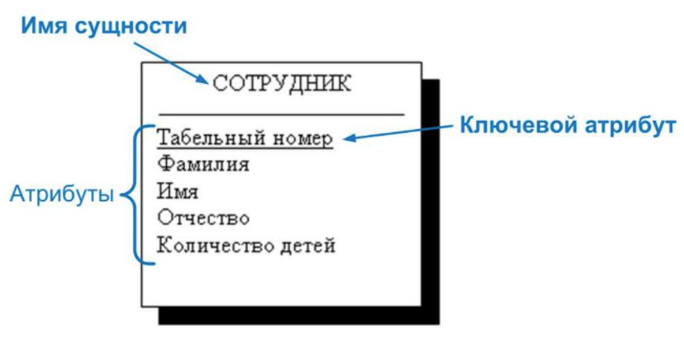
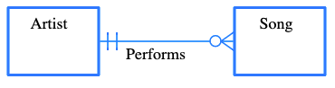
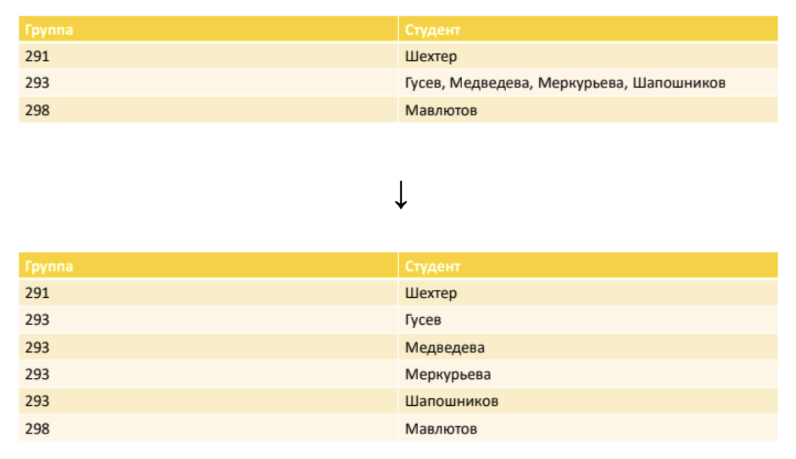
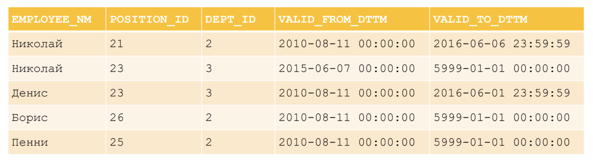
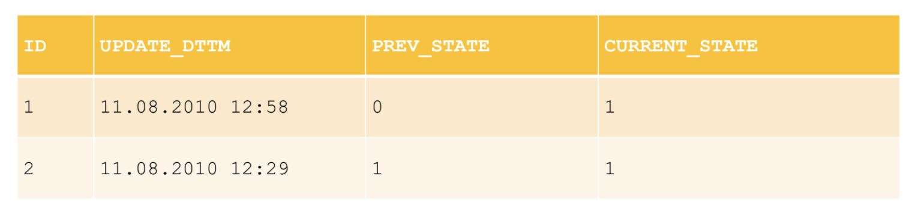
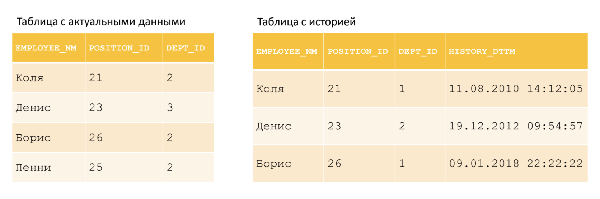

## Семинар 4. Проектирование, нормальные формы, версионирование

### 1. Проектирование

#### 1.1. Основные этапы проектирования

#### 1.1.1. Концептуальное проектирование

1. Определяем предметную область, с которой будем работать. Например, предметная область ритейла.
2. Разбиваем на не детализированные сущности. Например, чек покупки, продукт, магазин, ассортиментная матрица и т.д.
3. Определяем, как сущности будут друг с другом связаны: один к одному, один ко многим и т.д.
4. Строим визуальную картину в ER-нотации "Воронья лапка" (Crow's Foot) без явных атрибутов.

**Нотация "Воронья лапка"**

* Сущность изображается в виде прямоугольника, содержащего ее имя.
* Атрибуты сущности записываются внутри прямоугольника, изображающего сущность.
* Связь изображается линией, которая соединяет две сущности, участвующие в отношении.
* Множественность связи изображается в виде вилки. Необязательность связи помечается кружком.





Связь сущностей Artist и Song с использованием нотации Crow's Foot. Песня (Song) имеет «одного и только одного» исполнителя (Artist); исполнитель связан с «нулем, одной или несколькими» песнями.

#### 1.1.2. Логическое проектирование

1. Разбиваете не детализированные сущности на детализированные согласно выбранной модели данных и нормализации.
2. Определяем атрибуты.
2. Определяете связи между сущностями по атрибутам.
3. Строим визуальную картину в ER-нотации "Воронья лапка" (Crow's Foot) с явными атрибутами.

#### 1.1.3. Физическое проектирование

Физическое проектирование — создание схемы базы данных для конкретной СУБД. 
Специфика конкретной СУБД может включать в себя ограничения на именование объектов базы данных, 
ограничения на поддерживаемые типы данных и т. п. Кроме того, специфика конкретной СУБД при физическом проектировании 
включает выбор решений, связанных с физической средой хранения данных (выбор методов управления дисковой памятью, 
разделение БД по файлам и устройствам, методов доступа к данным), создание индексов и т.д..

*Результатом* физического проектирования логической схемы может быть SQL-скрипт и/или таблица с описанием по каждой 
сущности. 

**Пример**:   
SQL скрипт:
```postgresql
CREATE TABLE IF NOT EXISTS STUDENT (
    STUDENT_ID   INTEGER      PRIMARY KEY,
    STUDENT_NAME VARCHAR(128) NOT NULL,
    ... 
);
...
```
И табличка с описанием:  
**STUDENT**

| Название       | Описание      | Тип данных     | Ограничение   |
|----------------| ------------- | -------------- | --------------|
| `STUDENT_ID`   | Идентификатор | `INTEGER`      | `PRIMARY KEY` |
| `STUDENT_NAME` | Имя студента  | `VARCHAR(128)` | `NOT NULL`    |
| ...            | ...           | ...            | ...           |


#### 1.2. ER-диаграммы

Модель «сущность-связь» (Entity-Relationship Model, ER-model) – одна из наиболее известных и получивших широкое распространение моделей семантического моделирования – разработана П. Ченом в 1976 году.

Основные элементы ER-модели:
* Сущность (entity) – это предмет, который может быть идентифицирован некоторым способом, отличающим его от других предметов.
* Атрибут – свойство сущности (как, правило, атомарное).
* Ключевый атрибут – уникальный атрибут, однозначно идентифицирующий экземпляр сущности.
* Связь (relationship) – это ассоциация, устанавливаемая между сущностями. Степень связи – количество связанных сущностей.

Выделяют следующие нотации ER-диаграмм:
* классическая нотация П. Чена;
* нотация IDEFIX (Integration Definition for Information Modeling);
* нотация Ч. Бахмана;
* нотация Дж. Мартина («вороньи лапки»);
* нотация Ж.-Р. Абриаля (минмакс);
* диаграммы классов UML.

При построении ER-модели важно выделять типы бинарных связей, выделяют 4 типа связи:
* ноль или более;
* один или более;
* только один;
* ноль или один.


Пример ER-диаграммы для логической модели:


ER-диаграммы можно рисовать в [gliffy](https://www.gliffy.com/) или [draw.io](https://app.diagrams.net/). Нужно создать новый документ и выбрать нужный тип диаграммы.

---

### 2. Нормальные формы

**Нормальная форма:**
* список требований, который мы предъявляем к отношению, чтобы оно находилось в определенной НФ.
* свойство отношения в реляционной модели данных, характеризующее его с точки зрения избыточности, потенциально приводящей к логически ошибочным результатам выборки или изменения данных.

**Нормализация БД** — приведение БД к нормальной форме;
* Предназначена для:
    * Минимизации логической избыточности;
    * Уменьшения потенциальной противоречивости → устранение некоторых _аномалий_ обновления;
    * Разработки проекта БД, который является:
        * качественным представлением реального мира;
        * интуитивно понятным;
        * легко расширяемым в дальнейшем.
    * Упрощения процедуры применения необходимых ограничений целостности.
* Не предназначена для:
    * Изменения производительности БД;
    * Изменения физического объема БД.
* Производится за счет декомпозиции (разложения исходной переменной отношения на несколько эквивалентных) отношения:
    * декомпозиция без потерь (правильная) — обратимая декомпозиция.
* Польза:
    * Позволяет проектировать неплохие БД на первых порах.
    * Помогает избегать типичных ошибок при проектировании БД людям без опыта.
    * Формирует привычку делать нормально сразу, не оставляя на потом.
    * Постепенно вырабатывает навык проектирования, без прочной завязки на нормальных формах.

**Аномалия** — ситуация в таблице БД, возникшая из-за излишнего дублирования в таблице, такая, что:
* Существенно осложнена работа с БД;
* В БД присутствуют противоречия.

**Нормальные формы:**
1. *Первая нормальная форма (1NF)*:
    * Значения всех атрибутов отношения атомарны (все атрибуты простые, содержат только скалярные значения):



2. *Вторая нормальная форма (2NF)*:
    * 1NF (атомарность атрибутов) + каждый неключевой атрибут минимально функционально зависит от потенциального ключа (1NF всегда можно привести к 2NF, и этот процесс обратим):

Здесь автор слов и композитор зависят только от полей “Название группы” и “Название песни”, то есть от подмножества PK (от того, что песня включена в другой CD-диск, автор слов и композитор не изменятся)


3. *Третья нормальная форма (3NF)*:
    * 2NF (атомарность атрибутов, минимальная функциональная зависимость от PK) + каждый неключевой атрибут нетранзитивно функционально зависит от первичного ключа (каждое неключевое поле должно содержать информацию о ключе, полном ключе и ни о чем, кроме ключа)

Здесь присутствуют функциональные зависимости:
* Сотрудник → Отдел
* Отдел → Телефон
* Сотрудник →Телефон


Разбиваем таблицу так, чтобы избавиться от транзитивности: разносим атрибуты "Сотрудник" и "Телефон" по разным отношениям.

4. *Нормальная форма Бойса-Кодда (BCNF)*
5. *Четвертая нормальная форма (4NF)*
6. *Пятая нормальная форма / Нормальная форма проекции-соединения (5NF / PJNF)*
7. *Доменно-ключевая нормальная форма (DKNF)*
8. *Шестая нормальная форма (6NF)*

**Функциональная зависимость** между множествами атрибутов X и Y означает,  что для любого допустимого набора кортежей в данном отношении верно следующее: если два кортежа совпадают по значению X, то они совпадают по значению Y.

**Минимальная функциональная зависимость** — ни для одного из атрибутов мы не можем выделить подмножество в потенциальном ключе, такое, чтобы атрибут от него функционально зависел.

---

### 3. Версионирование

#### 3.1. SCD. Типы SCD

**SCD (Slowly Changing Dimension)** —  редко изменяющиеся измерения, то есть измерения, не ключевые атрибуты которых имеют тенденцию со временем изменяться.

Выделяют пять основных типов:

* **SCD 0**: после попадания в таблицу данные никогда  не изменяются — не поддерживает версионность. Практически никогда не используется.
* **SCD 1**: данные перезаписываются (всегда актуальные) — используется, если история не нужна.
    * _Достоинства:_
        * Не добавляет избыточность;
        * Очень простая структура.
    * _Недостатки:_
        * Не хранит историю.
* **SCD 2**: храним историю с помощью двух полей (дата начала действия, дата окончания действия: `valid_from`, `valid_to`) — _используется наиболее часто_.
    * _Достоинства:_
        * Хранит полную и неограниченную историю версий;
        * Удобный и простой доступ к данным необходимого периода.
    * _Недостатки:_
        * Провоцирует на избыточность или заведение доп. таблиц для хранения изменяемых атрибутов.



Вместо `NULL` используется некоторая константа (для `valid_to — '9999-12-31'`), что позволяет писать простое условие:
```sql
WHERE day_dt BETWEEN valid_from_dttm AND valid_to_dttm
```
вместо
```sql
WHERE day_dt >= valid_from_dttm
    AND (day_dt <= valid_to_dttm
        OR valid_to_dttm IS NULL)
```

* **SCD 3**: храним старое значение для выделенных атрибутов в отдельных полях. При получении новых данных старые данные перезаписываются текущими значениями.
    * _Достоинства:_
        * Небольшой объем данных;
        * Простой и быстрый доступ к истории.
    * _Недостатки:_
        * Ограниченная история.



* **SCD 4**: храним в основной таблице только актуальные данные и историю изменений в отдельной таблице. Основная таблица всегда перезаписывается текущими данными с перенесением старых данных в другую таблицу. Обычно этот тип используют для аудита изменений или создания архивных таблиц.
    * _Достоинства:_
        * Быстрая работа с текущими версиями
    * _Недостатки:_
        * Разделение единой сущности на разные таблицы



---

### 4. Практическое задание

1. Спроектируйте концептуальные базы данных для следующих предметных областей ниже. Предварительно выберите нормальную 
форму, подумайте над версионностью. 

* Физтех. Ключевые сущности: физтех-школа, кафедра, группа, студент, преподаватель, должность, аудитория, расписание
  занятий.
* Розничная сеть магазинов. Ключевые сущности: магазин, сотрудник, товар, чек, карта лояльности, кассовый аппарат.

2. Опишите спроектированные модели с помощью языка запросов SQL.


